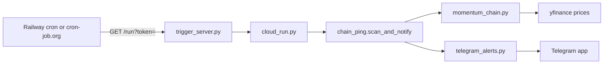

# System verification & proof

> Auto-generated **2026-05-17 22:45:46** by `python generate_verification.py`  
> Re-run anytime to refresh prices and test output.

## What this document proves

1. **Pipeline runs** — scans ~500 tickers, builds volatility chains, formats alerts.
2. **Telegram path works** — when `TELEGRAM_BOT_TOKEN` and `TELEGRAM_CHAT_ID` are set, `test_system.py` sends a real message.
3. **Chain semantics are explicit** — each link shows 21d correlation, together/inverse, lead/lag days, and whether **today** moved the same way.

This does **not** prove every chain will be profitable — only that the system computes and delivers the described output.

---

## Automated tests (`test_system.py`)

Exit code: **0** → **PASSED**

```
============================================================
============================================================
[PASS] imports
[PASS] scan — 518 tickers, 8 chains, 6 movers
[PASS] message — 1409 chars, timestamp + prices + timing (lead/lag in data)
[PASS] telegram — message delivered
[PASS] trigger server — /health 200, bad token 403
============================================================
ALL CHECKS PASSED
```

---

## Live scan snapshot

| Field | Value |
|-------|-------|
| Scan time | `2026-05-17 22:45:46` |
| Universe | 518 tickers |
| Volatility chains (top N) | 8 |
| Movers (≥ 1.5% 1d) | 5 |

### Movers summary

| Focus | Price | 1d % | 5d % | Top peer | corr | lag | today vs focus |
|-------|-------|------|------|----------|------|-----|----------------|
| RKLB | $124.77 | -5.9% | +18.3% | LUNR | +0.88 | same day | same way today |
| AKAM | $150.88 | -3.1% | +2.1% | — | — | — | — |
| JOBY | $10.36 | -2.6% | -4.7% | — | — | — | — |
| DDOG | $207.98 | +2.5% | +3.9% | — | — | — | — |
| ZTS | $74.22 | -1.7% | -10.4% | — | — | — | — |

---

## Sample Telegram message (plain text)

This is exactly what `chain_ping.format_telegram_ping()` produces (HTML tags stripped):

```
Chain alert
2026-05-17 22:45:46

RKLB  $124.77  -5.9% today  (+18.3% over 5 days)
Linked names (21d pattern; today may differ):
  • LUNR  $33.89  -7.2% today — corr +0.88, together; same day; same way today
  • BKSY  $38.75  -9.2% today — corr +0.82, together; same day; same way today
  • PL  $41.62  -3.3% today — corr +0.76, together; same day; same way today
  • ASTS  $83.67  +0.8% today — corr +0.75, together; same day; opposite today
  • SPCE  $2.81  -2.4% today — corr +0.70, together; same day; same way today
Market:
  • ARKK  $74.90  -4.0% today — corr +0.53, together; same day; same way today
  • SMH  $556.34  -3.8% today — corr +0.48, together; same day; same way today
  • USO  $148.23  +3.7% today — corr -0.47, inverse; leads ~3d; opposite today

AKAM  $150.88  -3.1% today  (+2.1% over 5 days)
Market:
  • ^VIX  $18.43  +6.8% today — corr -0.55, inverse; leads ~3d; opposite today
  • ARKK  $74.90  -4.0% today — corr +0.49, together; leads ~2d; same way today
  • SMH  $556.34  -3.8% today — corr +0.54, together; same day; same way today

JOBY  $10.36  -2.6% today  (-4.7% over 5 days)
Market:
  • ^VIX  $18.43  +6.8% today — corr +0.54, together; leads ~2d; opposite today
  • ARKK  $74.90  -4.0% today — corr +0.65, together; same day; same way today
  • SMH  $556.34  -3.8% today — corr +0.55, together; same day; same way today

DDOG  $207.98  +2.5% today  (+3.9% over 5 days)
Market:
  • ^VIX  $18.43  +6.8% today — corr +0.35, together; lags ~2d; same way today
  • ARKK  $74.90  -4.0% today — corr +0.40, together; leads ~1d; opposite today
  • USO  $148.23  +3.7% today — corr -0.52, inverse; leads ~1d; same way today
```

---

## Field glossary

| Label | Meaning |
|-------|---------|
| **corr +0.88** | Over the last **21 trading days**, daily returns tended to move in the same direction. |
| **corr −0.47** | **Inverse** relationship over 21d (when focus up, peer often down). |
| **together / inverse** | Human label from corr sign (≥ +0.25 together, ≤ −0.25 inverse). |
| **leads ~Nd** | Peer’s returns align best when shifted **N days earlier** than focus (`lead_lag_days > 0`). |
| **lags ~Nd** | Focus tends to move **before** the peer. |
| **same day** | Best alignment at 0-day lag (within ±3 day search window). |
| **same way / opposite today** | Compares **today’s** % move only — can disagree with 21d pattern. |

### Worked example (from this scan)

- **RKLB** −5.9% with **ASTS** +0.8%: corr +0.75 **together** over 21d, but **opposite today**.
- **USO** vs **RKLB**: corr −0.47 **inverse**, **leads ~3d**, **opposite today**.

---

## Architecture



| File | Role |
|------|------|
| `momentum_chain.py` | Rank vol, compute corr + lead/lag, build `ChainLink` list |
| `chain_ping.py` | Filter movers, format message with timing labels |
| `cloud_run.py` | Entry for scheduled runs |
| `trigger_server.py` | HTTP `/health`, `/run` on Railway |
| `test_system.py` | Smoke tests + optional Telegram send |

---

## How to verify yourself

```bash
cd /Users/home/stocks
set -a && source .telegram_config && set +a   # if you use local secrets
python3 test_system.py
python3 generate_verification.py              # refreshes this file
python3 chain_ping.py                         # dry-run message to terminal
```

**Railway:** set `TELEGRAM_BOT_TOKEN`, `TELEGRAM_CHAT_ID`, `CRON_SECRET`, then:

`https://YOUR-APP.up.railway.app/run?token=YOUR_CRON_SECRET`

Check your Telegram chat for a **Chain alert** matching the format above.

---

## Environment

| Variable | Default | Purpose |
|----------|---------|---------|
| `MOMENTUM_TOP_N` | 8 | How many volatile names get full chains |
| `PING_MOVE_MIN_PCT` | 1.5 | Min \|1d%\| to include in alert body |
| `TELEGRAM_BOT_TOKEN` | — | Bot API token |
| `TELEGRAM_CHAT_ID` | — | Destination chat |
| `CRON_SECRET` | — | Protects `/run` endpoint |

---

*End of verification report.*
